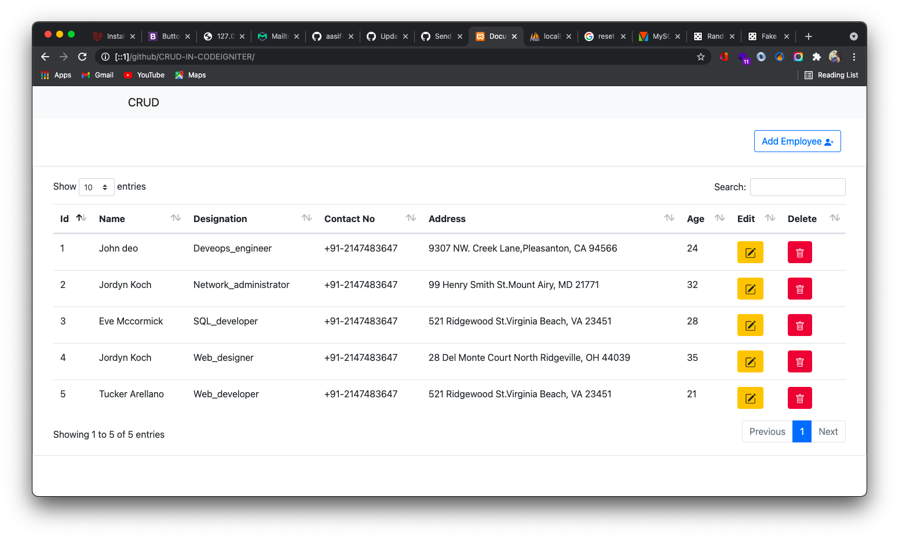
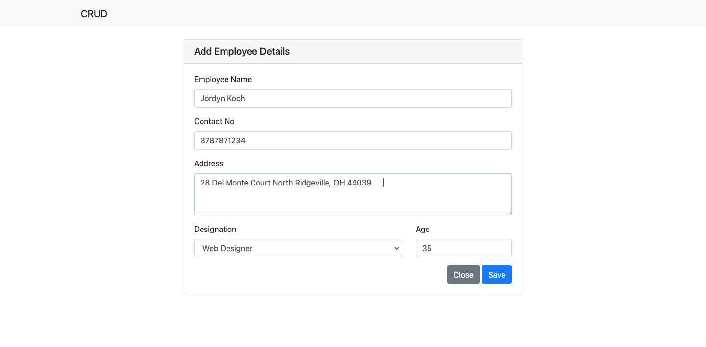
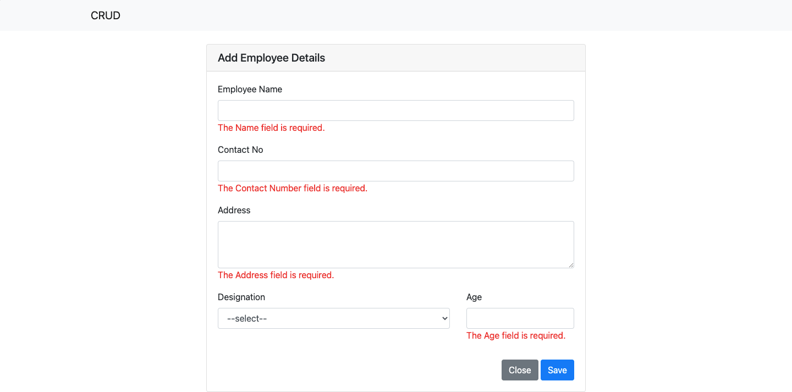
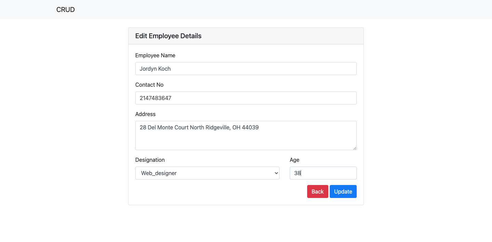
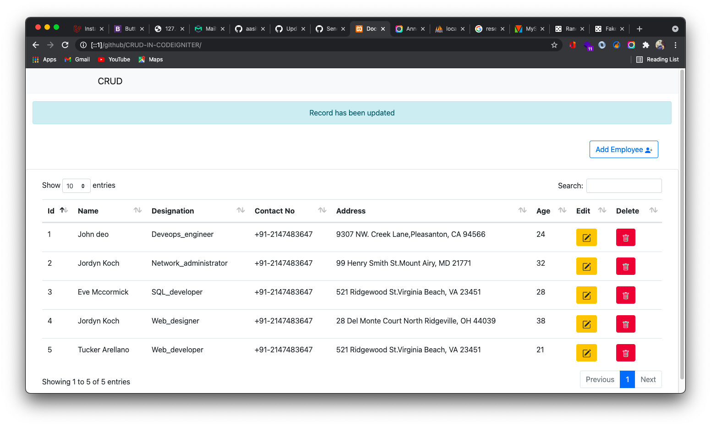
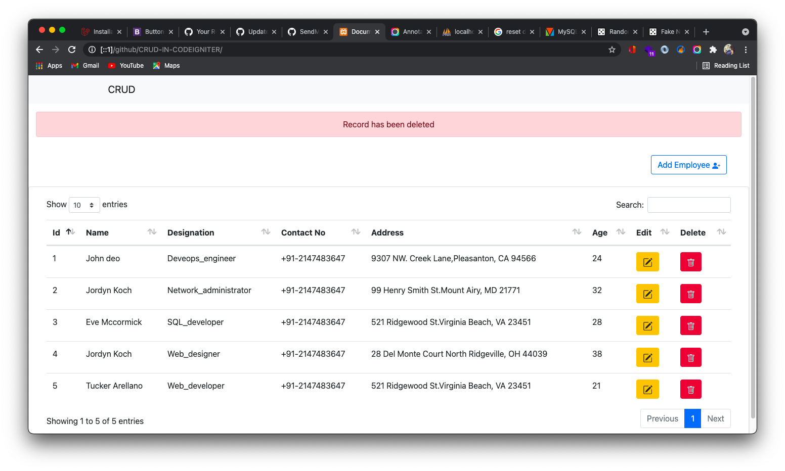
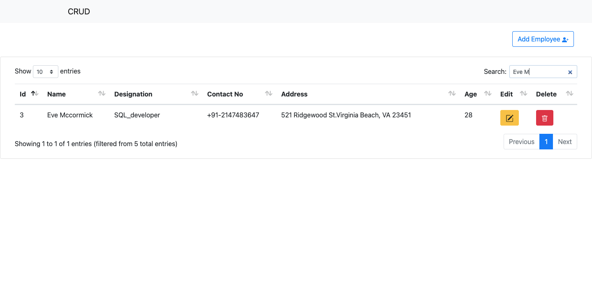
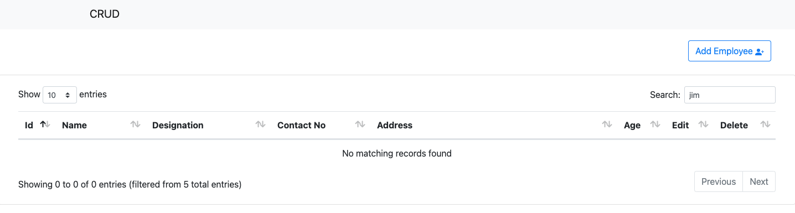

# Crud-In-Codeigniter

### 1. Home Page

### 2. Add Employee Details

### 3. Validation Check

### 4. Edit Record

### 5. Update notification

### 6. Delete Record

### 7. Search

### 8. No Match Found

